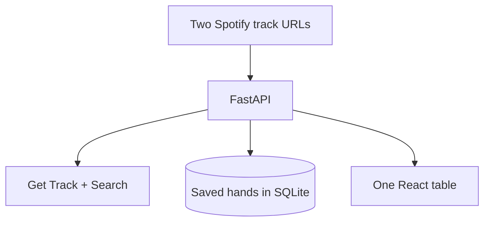

# The Hand

One table. Two Spotify links. A dealt set of songs as a **stack of poker cards**.

Paste an opening track and a closing track. The backend looks those tracks up (no local song database), walks a short artist path using genre tags, and deals a hand whose size you set in **cards** or **minutes**. Click the card peeking out to advance. Save a deal as a **hand**.

This is not a listening-graph dashboard and it does not use Spotify Radio, audio features, or related-artists.

## Features

- Paste two `open.spotify.com/track/…` links
- Length as number of songs or target minutes (`duration_ms` from the track object)
- Stacked poker cards: off-white stock, royal blue, dotted **album** halftone (not a dotted page background)
- Titles use **Stara** when it is installed on the machine (geometric sans from the specimen); otherwise Quicksand. Body copy is Helvetica Neue.
- Front card can play via the Spotify embed
- Save / reopen / fold hands

## Architecture



## Tech stack

React, TypeScript, Vite, Tailwind, FastAPI, SQLAlchemy, NetworkX (artist-path only).

## Running locally

You need **Python 3.10+** and **Node.js 20+**. `npm` and `uvicorn` are **not** system commands until those are installed.

### 1. Install Node (fixes `npm: command not found`)

In Terminal:

```bash
curl -o- https://raw.githubusercontent.com/nvm-sh/nvm/v0.40.3/install.sh | bash
source ~/.zshrc
nvm install 22
node -v
npm -v
```

You should see version numbers, not “command not found”.

### 2. Python API (fixes `uvicorn: command not found`)

Always from the **repo root** (`spotify-listen-graph`), not `frontend/`:

```bash
cd ~/spotify-listen-graph   # use your actual clone path
git pull

python3 -m venv .venv
source .venv/bin/activate
python -m pip install --upgrade pip
pip install -r backend/requirements.txt
cp -n .env.example .env
mkdir -p data/local
```

`pip` is looking for `backend/requirements.txt` **relative to your current folder**. If you see “No such file”, you are not in the repo root. Run `ls`: you should see `backend`, `frontend`, and `README.md`. If you only see `src` or `package.json`, you are inside `frontend` — `cd ..` and try again.

To find the clone:

```bash
find ~ -name "requirements.txt" -path "*/backend/*" 2>/dev/null
```

Then `cd` into the directory **above** `backend` (the folder that also contains `frontend`).

```bash
cd ~/spotify-listen-graph
PYTHONPATH=backend .venv/bin/python -m uvicorn app.main:app --host 127.0.0.1 --port 8765
```

### 3. Frontend (new terminal)

```bash
source ~/.zshrc
cd ~/spotify-listen-graph/frontend
npm install
npm run dev -- --host 127.0.0.1 --port 4177
```

Open [http://127.0.0.1:4177](http://127.0.0.1:4177). Paste two track links and click **Deal**. Connect Spotify (top right) so live links can be looked up.

### Tests

```bash
PYTHONPATH=backend .venv/bin/pytest backend/tests -q
cd frontend && npx vitest run
```

## Environment variables

See `.env.example`. Never commit `.env`, tokens, or the SQLite file.

| Variable | Purpose |
| --- | --- |
| `SPOTIFY_CLIENT_ID` | Public OAuth client id |
| `SPOTIFY_CLIENT_SECRET` | Optional; used on the server if present |
| `SPOTIFY_REDIRECT_URI` | Must match the dashboard allowlist |
| `FRONTEND_ORIGIN` | Where OAuth redirects after callback |
| `SESSION_SECRET` | Cookie signing + token encryption key |
| `DATABASE_URL` | `sqlite:///./data/local/listening_graph.db` or Postgres |
| `SESSION_GAP_MINUTES` | Inactivity threshold (default 30) |

## Demo mode

Demo data is **synthetic**. Artist names are familiar so the UI can be read as a product; the timestamps and play counts are generated. A banner on every page states this. The similarity personas are also synthetic.

## Design

Cream table, royal blue ink, serif ranks. Dots live **on the album**, as a halftone, not on the page. Cards sit in a stack with a sliver of the next card showing.

## Spotify constraints

Not used: Audio Features, Audio Analysis, Recommendations, Related Artists.

Track lookup uses Get Track / Search. Duration uses `duration_ms` on the track object.

## License

MIT
