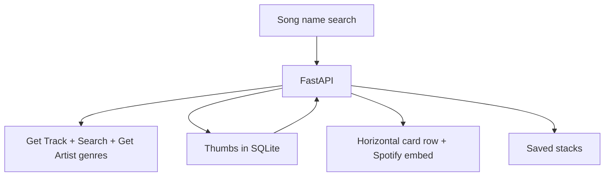

# Dealt

Dealt turns two songs into a short playlist you can **see in a row** and **play on the page**.

The landing page keeps a messy scatter of sample cards. Search an opening track and a closing track (type names, or paste a Spotify link), then click **Deal**. The generated songs land in a spaced horizontal row: the open card is the player, the rest peek wider so you can read them, and a list on the right names every song in the stack. Click a peek or a list row to open that song.

Thumbs up / thumbs down on a card are stored for your account. Later deals skip thumbs-down artists and prefer thumbs-up artists while walking genre tags from the start vibe to the end vibe.

This is not a listening-graph dashboard. It does not use Spotify Radio, Audio Features (no BPM from Spotify), Audio Analysis, Recommendations, or Related Artists.

## Features

- Search by song or artist (live Spotify Search when `.env` credentials are loaded)
- Official Spotify embed on the open card (real track ids only; demo catalog cannot stream)
- Horizontal poker-card row: open card as the player, wider peeks of the rest, plus a text list of the whole stack
- Length in number of songs or target minutes (`duration_ms`)
- Genre-pace walk from opening artist tags toward the close
- Thumbs personalize later deals
- Save / reopen / fold stacks
- Cool gray-white, royal blue, Helvetica Neue, dotted **DEALT** wordmark, dotted stars and notes

## Play on the site

Playback is Spotify’s embed widget, not a custom audio file.

1. Put `SPOTIFY_CLIENT_ID` and `SPOTIFY_CLIENT_SECRET` in the repo-root `.env` (no quotes).
2. Redirect URI in the Spotify Dashboard: `http://127.0.0.1:8765/api/auth/callback`
3. Start the API so it can read `.env`, then click **Connect Spotify**.
4. Deal two real songs. The open card shows a Play button. Free Spotify accounts get a preview; Premium can play the full track in the embed, subject to Spotify’s widget rules.

If a card says it cannot stream, the id is from the demo catalog (`syn-…`) or the API never looked the track up on Spotify.

## Connect Spotify

The file is named `.env` (leading dot), next to `README.md`, `backend`, and `frontend`. VS Code may hide it.

```
SPOTIFY_CLIENT_ID=yourid
SPOTIFY_CLIENT_SECRET=yoursecret
SPOTIFY_REDIRECT_URI=http://127.0.0.1:8765/api/auth/callback
```

Restart uvicorn after saving `.env`. Check:

```bash
curl http://127.0.0.1:8765/api/health
```

`catalog_ready` should be `true`. Then refresh the UI.

The VS Code notice about `python.terminal.useEnvFile` is optional. Dealt reads `.env` from disk when the API starts.

## Architecture



## Tech stack

React, TypeScript, Vite, Tailwind, FastAPI, SQLAlchemy, NetworkX (genre-pace walk).

## Running locally

You need **Python 3.10+** and **Node.js 20+**.

### Fastest: both servers

From the repo root, leave this running:

```bash
bash scripts/dev.sh
```

Open [http://127.0.0.1:4177](http://127.0.0.1:4177).

`curl: Failed to connect to port 8765` means uvicorn is not running. Start it (or use `scripts/dev.sh`) **before** using the site.

### Install Node (if `npm` is missing)

```bash
curl -o- https://raw.githubusercontent.com/nvm-sh/nvm/v0.40.3/install.sh | bash
source ~/.zshrc
nvm install 22
```

### API only

From the folder that contains `backend` and `README.md`:

```bash
python3 -m venv .venv
source .venv/bin/activate
pip install -r backend/requirements.txt
cp -n .env.example .env
mkdir -p data/local
PYTHONPATH=backend python -m uvicorn app.main:app --host 127.0.0.1 --port 8765
```

### UI only (second terminal)

```bash
cd frontend
npm install
npm run dev -- --host 127.0.0.1 --port 4177
```

### Tests

```bash
PYTHONPATH=backend .venv/bin/pytest backend/tests -q
cd frontend && npx vitest run
```

## Environment variables

Never commit `.env`.

| Variable | Purpose |
| --- | --- |
| `SPOTIFY_CLIENT_ID` | Spotify app client id |
| `SPOTIFY_CLIENT_SECRET` | Client secret for catalog Search |
| `SPOTIFY_REDIRECT_URI` | Must match the Dashboard, local default `http://127.0.0.1:8765/api/auth/callback` |
| `PUBLIC_BASE_URL` | Production origin; callback becomes `{PUBLIC_BASE_URL}/api/auth/callback` |
| `SESSION_SECRET` | Cookie signing |
| `DATABASE_URL` | `sqlite:///./data/local/listening_graph.db` (keep the `./`) |

## Demo mode

Without credentials the table still deals from a small synthetic catalog. Those cards cannot play. Names are familiar; plays are invented.

## Design

Paper `#f1f3f6` with white cards, royal blue, Helvetica Neue. Dotted wordmark. Dotted stars and music notes sit beside the table. Album art uses a dotted overlay.

## Deploy

1. `cd frontend && npm ci && npm run build`
2. Set Spotify secrets, `SESSION_SECRET`, and `PUBLIC_BASE_URL`
3. Add `https://your-domain/api/auth/callback` in the Spotify Dashboard
4. `PYTHONPATH=backend python -m uvicorn app.main:app --host 0.0.0.0 --port $PORT`

Or `docker build -t dealt .` and `docker run --env-file .env -e PUBLIC_BASE_URL=https://your-domain -p 8765:8765 dealt`

## Spotify constraints

Not used: Audio Features, Audio Analysis, Recommendations, Related Artists.

Used: Search, Get Track, Get Artist (genre tags), OAuth, official embed. Duration from `duration_ms`. Taste from your thumbs, not a trained audio model.

## License

MIT
