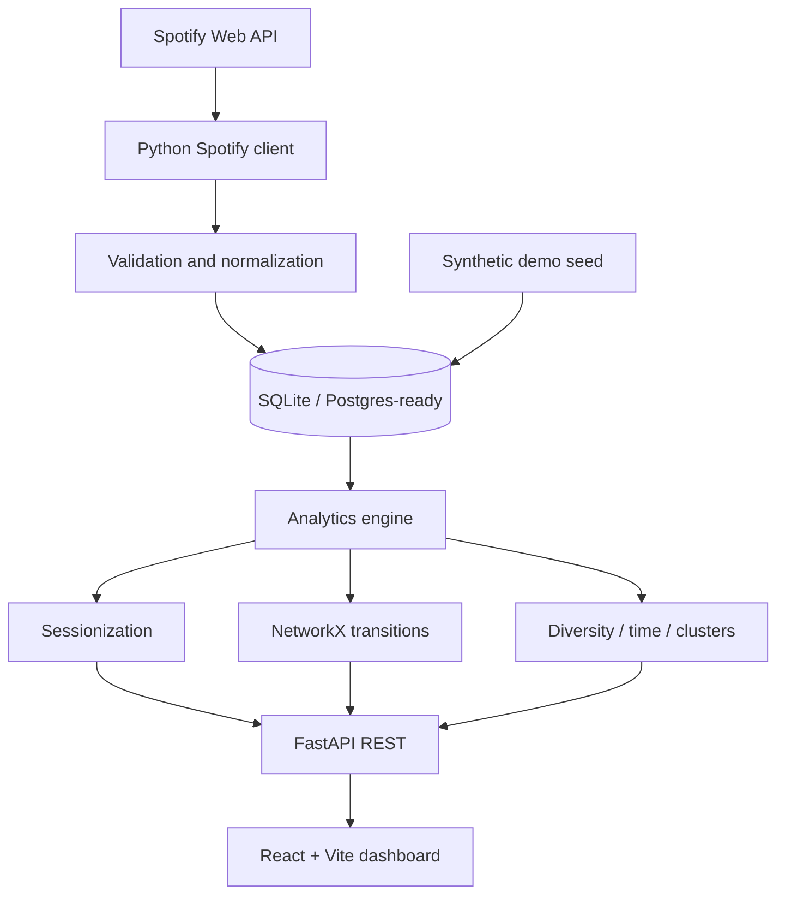

# Spotify Personal Listening Graph

An interactive study of **how listening behavior evolves** — sessions, artist-to-artist handoffs, time-of-day rhythm, and taste concentration — built as a FastAPI analytics engine with a restrained editorial frontend. It is not a Spotify Wrapped clone, and it does not use deprecated audio-features or recommendation APIs.

## Why I built this

Play counts are easy. The more interesting questions are behavioral: which artists follow which other artists *inside a sitting*, how concentrated the mix is, and whether “who I am at 10pm” is different from “who I am on a Saturday.” This project treats listening as a timestamped event stream, then as a graph.

## Features

- **Connect Spotify** to ingest *your* recently played tracks and top items (personalized dashboard)
- **Discover → bridge**: opening track + destination track → a stepping-stone set using genre overlap and session handoffs
- **Discover → neighbors**: paste a Spotify track link (or type a name) for same-artist / shared-genre / graph-neighbor suggestions
- **Demo mode** with a labeled synthetic library so reviewers can use the product without Spotify credentials
- **OAuth 2.0 authorization code + PKCE**, tokens stored only on the server
- **Ingestion** of currently available Spotify user data: recently played, top artists/tracks, profile
- **Sessionization** with a configurable inactivity gap
- **Directed artist transition graph** with \(P(B \mid A)\), PageRank, and a readable D3 view
- **Temporal patterns** by hour, weekday, month, and season
- **Diversity metrics** (entropy, concentration, repeat rate) with honest interpretation
- **Exploratory clustering** on behavioral vectors — not audio, not a personality quiz
- **Explainable revisit heuristics** (not Spotify Radio, not a trained catalog model)
- **Optional similarity engine** demonstrated with synthetic personas
- **Clear my data** and a privacy-conscious scope list

## Architecture



The frontend never talks to Spotify. The backend owns authentication, persistence, and every non-trivial calculation.

## Data model

Normalized tables, with integer primary keys so PostgreSQL can replace SQLite later:

| Table | Role |
| --- | --- |
| `users` | Spotify account or demo identity |
| `oauth_tokens` | Encrypted access/refresh tokens |
| `artists`, `tracks`, `genres`, `artist_genres`, `track_artists` | Catalog |
| `listening_events` | Unique `(user, track, played_at)` plays |
| `listening_sessions`, `session_events` | Derived sittings |
| `artist_transitions` | Directed weighted handoffs |
| `top_snapshots` | `/me/top` ranks stored as snapshots, **not** extra plays |

Indexes cover `(user_id, played_at)`, transition lookups, and unique ingestion keys.

## Analytics

See [docs/ANALYTICS.md](docs/ANALYTICS.md) for sessionization, transition probability, entropy, clustering features, and ranking formulas.

## Tech stack

**Frontend:** React, TypeScript, Vite, Tailwind CSS, Recharts, D3  
**Backend:** Python, FastAPI, Pydantic, SQLAlchemy  
**Data:** pandas / NumPy, scikit-learn (K-means on behavioral vectors), NetworkX  
**Tests:** pytest, Vitest

## Running locally

You need **Python 3.10+** and **Node.js 20+**. `npm` and `uvicorn` are **not** system commands until those are installed.

### 1. Install Node (fixes `npm: command not found`)

In Terminal:

```bash
curl -o- https://raw.githubusercontent.com/nvm-sh/nvm/v0.40.3/install.sh | bash
source ~/.zshrc
nvm install 22
node -v
npm -v
```

You should see version numbers, not “command not found”.

### 2. Python API (fixes `uvicorn: command not found`)

Always from the **repo root** (`spotify-listen-graph`), not `frontend/`:

```bash
cd ~/spotify-listen-graph   # use your actual clone path
git pull

python3 -m venv .venv
source .venv/bin/activate
python -m pip install --upgrade pip
pip install -r backend/requirements.txt
cp -n .env.example .env
mkdir -p data/local
```

`pip` is looking for `backend/requirements.txt` **relative to your current folder**. If you see “No such file”, you are not in the repo root. Run `ls`: you should see `backend`, `frontend`, and `README.md`. If you only see `src` or `package.json`, you are inside `frontend` — `cd ..` and try again.

To find the clone:

```bash
find ~ -name "requirements.txt" -path "*/backend/*" 2>/dev/null
```

Then `cd` into the directory **above** `backend` (the folder that also contains `frontend`).

```bash
cd ~/spotify-listen-graph
PYTHONPATH=backend .venv/bin/python -m uvicorn app.main:app --host 127.0.0.1 --port 8765
```

### 3. Frontend (new terminal)

```bash
source ~/.zshrc
cd ~/spotify-listen-graph/frontend
npm install
npm run dev -- --host 127.0.0.1 --port 4177
```

Open [http://127.0.0.1:4177](http://127.0.0.1:4177) and choose **Explore the demo**.

### Tests

```bash
PYTHONPATH=backend .venv/bin/pytest backend/tests -q
cd frontend && npx vitest run
```

## Environment variables

See `.env.example`. Never commit `.env`, tokens, or the SQLite file.

| Variable | Purpose |
| --- | --- |
| `SPOTIFY_CLIENT_ID` | Public OAuth client id |
| `SPOTIFY_CLIENT_SECRET` | Optional; used on the server if present |
| `SPOTIFY_REDIRECT_URI` | Must match the dashboard allowlist |
| `FRONTEND_ORIGIN` | Where OAuth redirects after callback |
| `SESSION_SECRET` | Cookie signing + token encryption key |
| `DATABASE_URL` | `sqlite:///./data/local/listening_graph.db` or Postgres |
| `SESSION_GAP_MINUTES` | Inactivity threshold (default 30) |

## Demo mode

Demo data is **synthetic**. Artist names are familiar so the UI can be read as a product; the timestamps and play counts are generated. A banner on every page states this. The similarity personas are also synthetic.

## Design

Lavender paper background, soft purple-black type, a pastel lilac accent, large editorial headlines, and few cards. Charts answer a sentence (“Your listening peaks late at night”) rather than dumping axis labels. The network hides weak edges by default.

## Spotify constraints (intentional)

Not used, because they are restricted or the wrong product:

- Audio Features
- Audio Analysis
- Recommendations endpoint
- Training ML models on Spotify catalog audio

Recently played history is short. This app accumulates what the API allows, stores top-item snapshots honestly, and uses demo mode when a dense timeline is required for review.

## Future improvements

- Background refresh of recently played so a real account can grow a long history
- Optional playlist ingestion behind an extra, clearly requested scope
- PostgreSQL in production and encrypted-at-rest volume
- Export a personal analytics notebook without shipping raw events to a third party
- Multi-user cosine similarity once more than one real library exists

## License

MIT
