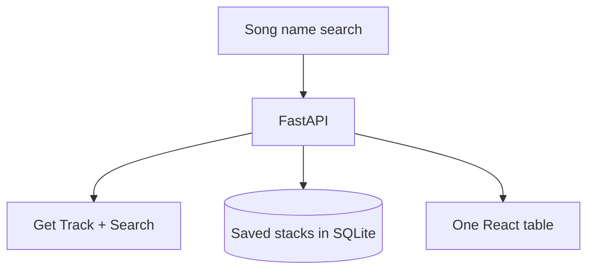

# Dealt

Search two songs. We deal a **stack of cards** from the first to the last.

Type a song name (or paste a Spotify link), pick from the results, set the length in **cards** or **minutes**, and click Deal. The front card can play through Spotify’s embed when the track is a real catalog id.

This is not a listening-graph dashboard and it does not use Spotify Radio, audio features, or related-artists.

## Features

- Search by song or artist name (Spotify Search when credentials are present; demo catalog otherwise)
- Length as number of songs or target minutes (`duration_ms` from the track object)
- Warm paper + royal blue, Helvetica Neue throughout
- Dotted **DEALT** wordmark and dotted star ornaments on the sides
- Halftone dots on album art only
- Save / reopen / fold stacks

## Connect Spotify (so search and playback are live)

Without credentials, search only hits a small local demo catalog, and those cards cannot play.

1. Create an app at [developer.spotify.com/dashboard](https://developer.spotify.com/dashboard).
2. Add this Redirect URI: `http://127.0.0.1:8765/api/auth/callback`
3. Copy Client ID and Client Secret into `.env`:

```
SPOTIFY_CLIENT_ID=…
SPOTIFY_CLIENT_SECRET=…
SPOTIFY_REDIRECT_URI=http://127.0.0.1:8765/api/auth/callback
```

4. Restart the API.
5. Click **Connect Spotify** in the top right and approve the app.

Client ID + Secret also enable catalog Search without logging in (client-credentials). Connecting your account is what ties the session to you. The player on a card is Spotify’s official embed for that track id.

## Architecture



## Tech stack

React, TypeScript, Vite, Tailwind, FastAPI, SQLAlchemy, NetworkX (artist-path only).

## Running locally

You need **Python 3.10+** and **Node.js 20+**. `npm` and `uvicorn` are **not** system commands until those are installed.

### 1. Install Node (fixes `npm: command not found`)

In Terminal:

```bash
curl -o- https://raw.githubusercontent.com/nvm-sh/nvm/v0.40.3/install.sh | bash
source ~/.zshrc
nvm install 22
node -v
npm -v
```

You should see version numbers, not “command not found”.

### 2. Python API (fixes `uvicorn: command not found`)

Always from the **repo root**, not `frontend/`:

```bash
cd ~/spotify-listen-graph   # use your actual clone path
git pull

python3 -m venv .venv
source .venv/bin/activate
python -m pip install --upgrade pip
pip install -r backend/requirements.txt
cp -n .env.example .env
mkdir -p data/local
```

`pip` is looking for `backend/requirements.txt` **relative to your current folder**. If you see “No such file”, you are not in the repo root. Run `ls`: you should see `backend`, `frontend`, and `README.md`. If you only see `src` or `package.json`, you are inside `frontend` — `cd ..` and try again.

```bash
PYTHONPATH=backend .venv/bin/python -m uvicorn app.main:app --host 127.0.0.1 --port 8765
```

### 3. Frontend (new terminal)

```bash
source ~/.zshrc
cd ~/spotify-listen-graph/frontend
npm install
npm run dev -- --host 127.0.0.1 --port 4177
```

Open [http://127.0.0.1:4177](http://127.0.0.1:4177). Search two songs and click **Deal**.

### Tests

```bash
PYTHONPATH=backend .venv/bin/pytest backend/tests -q
cd frontend && npx vitest run
```

## Environment variables

See `.env.example`. Never commit `.env`, tokens, or the SQLite file.

| Variable | Purpose |
| --- | --- |
| `SPOTIFY_CLIENT_ID` | Public OAuth client id |
| `SPOTIFY_CLIENT_SECRET` | Used for client-credentials catalog search |
| `SPOTIFY_REDIRECT_URI` | Must match the dashboard allowlist |
| `FRONTEND_ORIGIN` | Where OAuth redirects after callback |
| `SESSION_SECRET` | Cookie signing + token encryption key |
| `DATABASE_URL` | `sqlite:///./data/local/listening_graph.db` or Postgres |
| `SESSION_GAP_MINUTES` | Inactivity threshold (default 30) |

## Demo mode

Without Spotify credentials, search uses a **synthetic** local catalog so the table still deals. Artist names are familiar; timestamps and play counts are generated.

## Design

Warm paper (`#f7f0de`), royal blue ink, Helvetica Neue. The title is a dotted fill. Four-pointed dotted stars sit on the sides. Album art keeps its own halftone.

## Spotify constraints

Not used: Audio Features, Audio Analysis, Recommendations, Related Artists.

Track lookup uses Get Track / Search. Duration uses `duration_ms` on the track object.

## License

MIT
